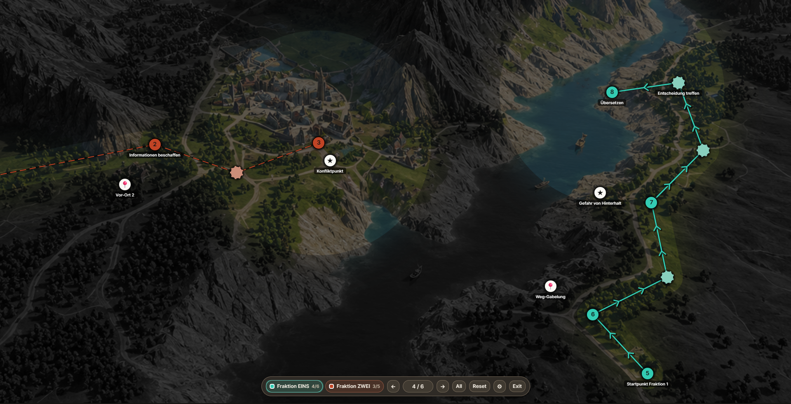
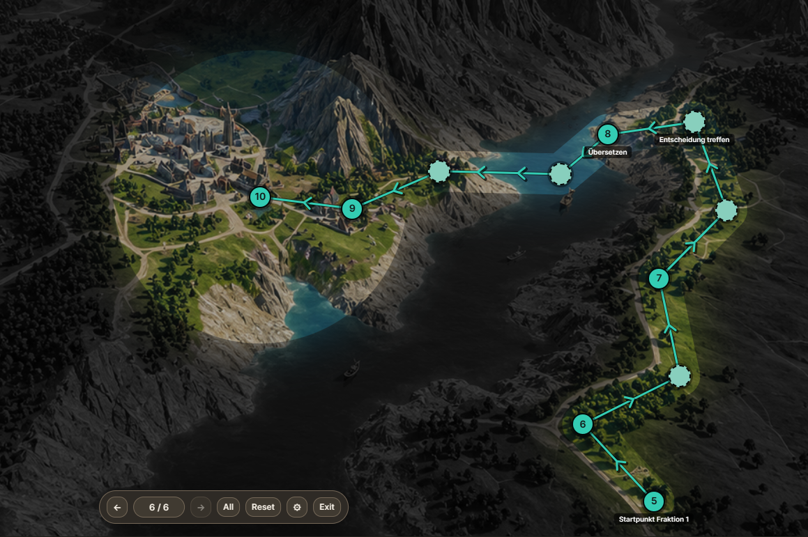
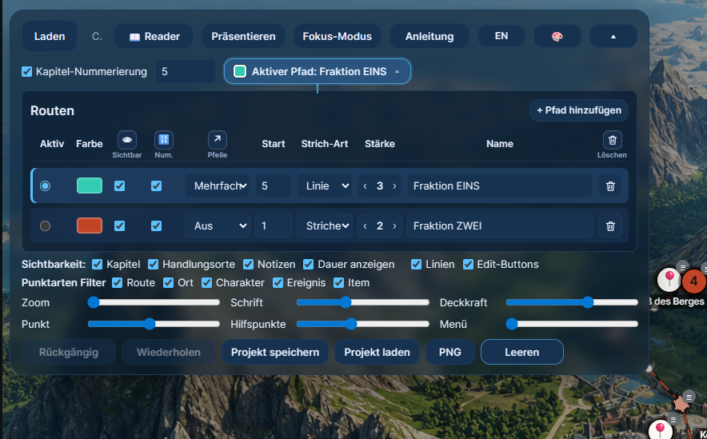
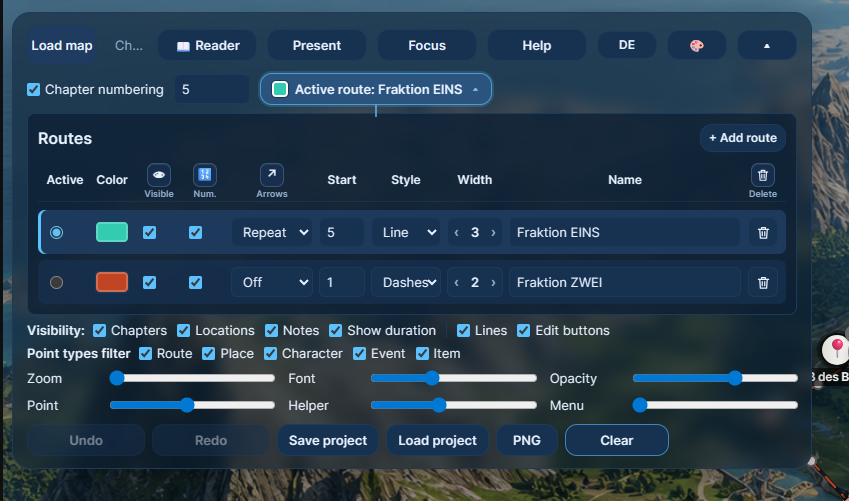
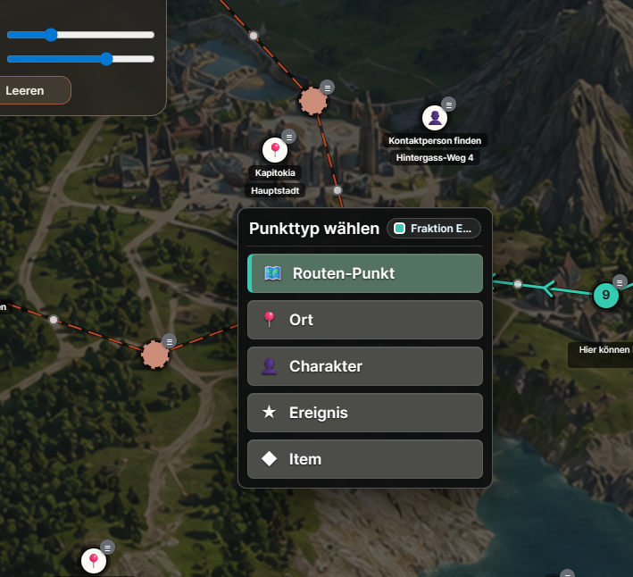
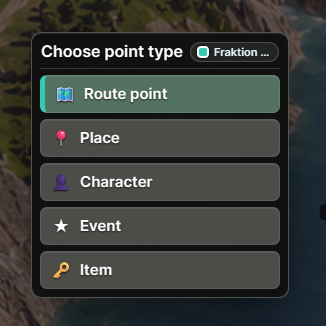
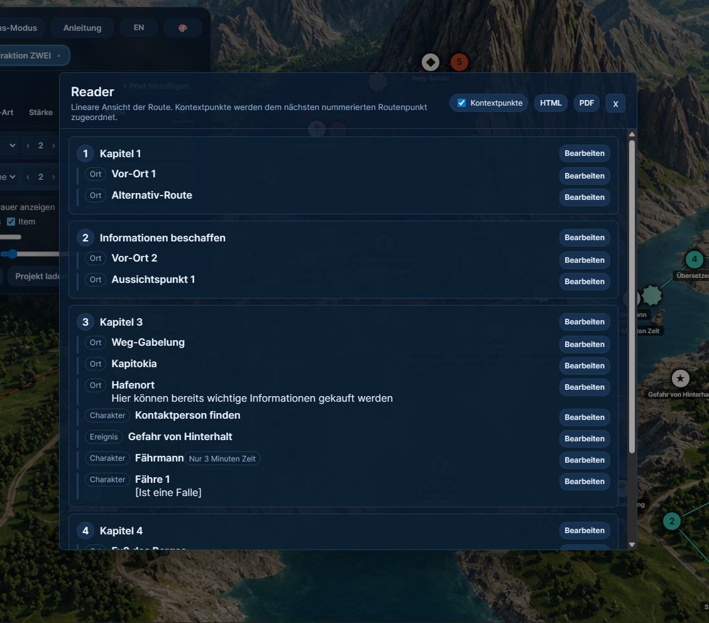
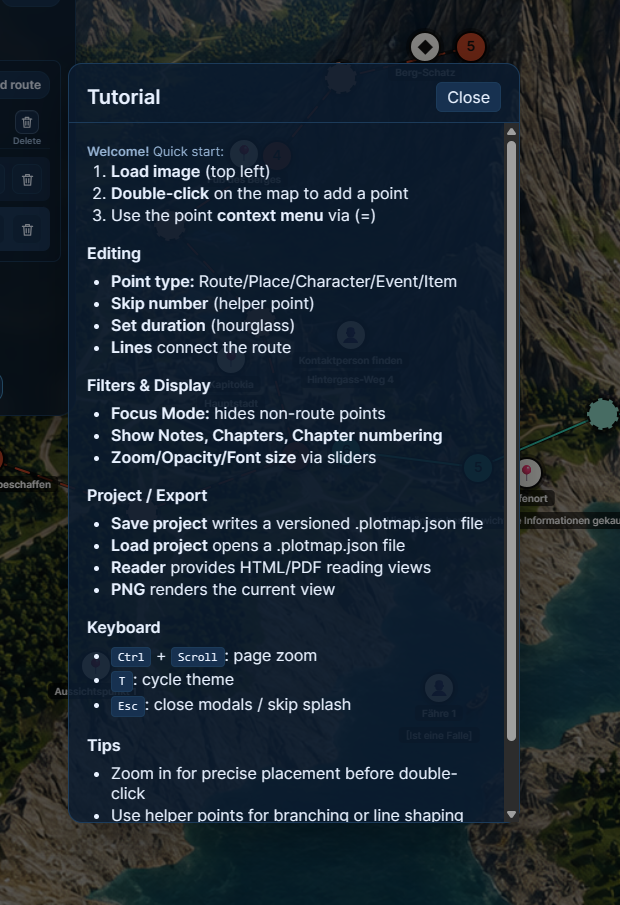
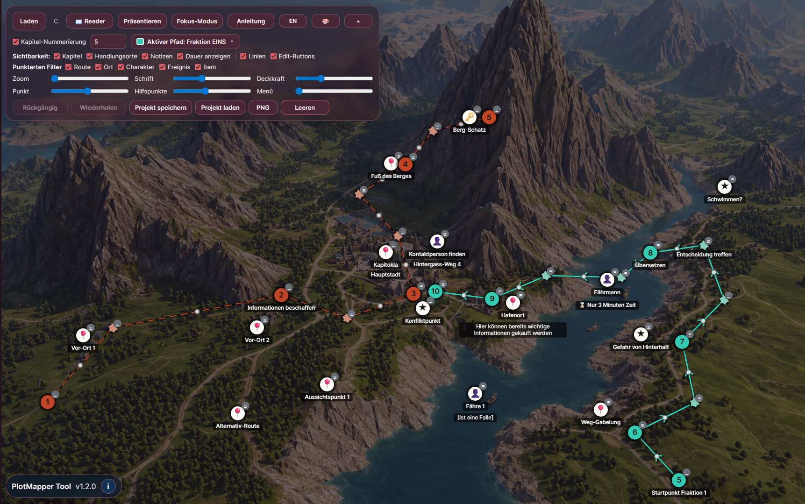
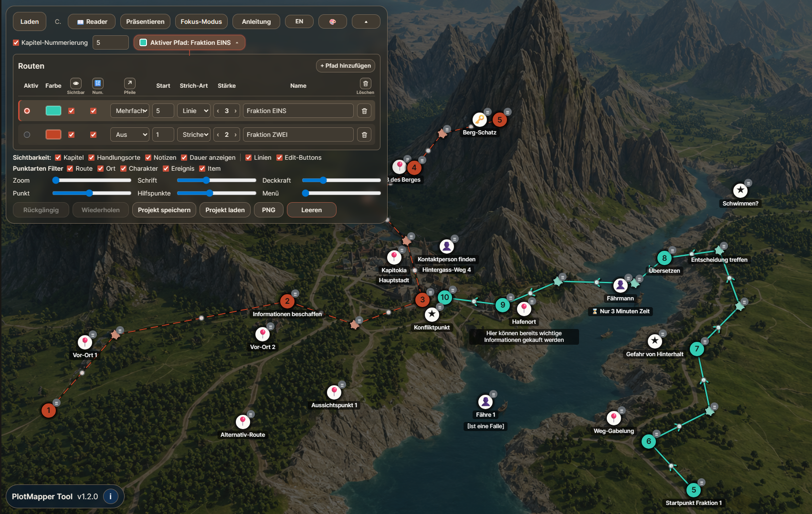

# PlotMapper

PlotMapper is a lightweight browser tool for planning story routes, locations, characters, events, items, notes, and reading flow directly on a map. It runs as a standalone HTML app and can be used locally or via GitHub Pages.

Deutsch weiter unten.

Live version: https://maxliebscher.github.io/PlotMapperTool/

## Screenshots

Click any screenshot to open it full size. Zum Vergrößern anklicken.

<p align="center">
  <a href="assets/screenshots/v1.2.0-presentation-multi-route-fog.png">
    
  </a>
</p>

<table>
  <tr>
    <td width="33%" valign="top">
      <a href="assets/screenshots/v1.2.0-focus-fog-route-reveal.png">
        
      </a>
    </td>
    <td width="33%" valign="top">
      <a href="assets/screenshots/v1.2.0-route-management-de.png">
        
      </a>
    </td>
    <td width="33%" valign="top">
      <a href="assets/screenshots/v1.2.0-route-management-en.png">
        
      </a>
    </td>
  </tr>
  <tr>
    <td width="33%" valign="top">
      <a href="assets/screenshots/v1.2.0-story-picker-de.png">
        
      </a>
    </td>
    <td width="33%" valign="top">
      <a href="assets/screenshots/v1.2.0-story-picker-en.png">
        
      </a>
    </td>
    <td width="33%" valign="top">
      <a href="assets/screenshots/v1.2.0-reader-context.png">
        
      </a>
    </td>
  </tr>
  <tr>
    <td width="33%" valign="top">
      <a href="assets/screenshots/v1.2.0-tutorial-help.png">
        
      </a>
    </td>
    <td width="33%" valign="top">
      <a href="assets/screenshots/v1.2.0-editor-burgund-theme.png">
        
      </a>
    </td>
    <td width="33%" valign="top">
      <a href="assets/screenshots/v1.2.0-editor-autumn-theme.png">
        
      </a>
    </td>
  </tr>
</table>

Presentation Mode can reveal multiple visible routes step by step. Each route keeps its own progress, nearby context points can appear along the revealed path, and Focus Fog keeps unexplored areas readable but visually pushed back.

## English

### What is PlotMapper?

PlotMapper helps writers, gamemasters, worldbuilders, teachers, and map-heavy planners turn a map image into a structured story path. Add route points, helper points, context points, notes, locations, labels, and durations, then review the path in a Reader view.

### Features

- Load any map or image as the planning background.
- Add route, place, character, event, and item points.
- Draw one or more route lines with adjustable color, width, line style, numbering, visibility, and arrows.
- Use helper points to shape paths or branch without changing route numbering.
- Edit labels, locations, notes, duration, helper state, type, and deletion from the point menu.
- Toggle filters, labels, locations, notes, duration, edit buttons, chapter numbering, and focus mode.
- Keep multi-route controls collapsed until you need to manage alternate paths.
- Tune point size, helper point size, map opacity, font size, and menu opacity without leaving the main toolbar.
- Present visible routes step by step with independent route progress, keyboard navigation, and configurable Focus Fog.
- Undo/redo point and editing changes.
- Switch themes and language between English and German.
- Save/load projects as versioned `.plotmap.json` files.
- Export the current view as PNG.
- Run from the generated standalone `index.html` without runtime CDN dependencies.
- Use the Reader modal for a linear route view, route/context editing, jump-to-map, HTML export, and PDF print flow.

### Project Format

The canonical app format is `.plotmap.json`. It stores the map image, settings, and all points in a round-trip-safe structure:

```json
{
  "schemaVersion": 1,
  "appVersion": "1.2.0",
  "map": {},
  "settings": {},
  "routes": [],
  "points": []
}
```

Legacy Markdown/old JSON import is intentionally not part of the main app anymore. Old projects can be converted later with a separate converter.

### How to Use

1. Open `index.html` or the live GitHub Pages version.
2. Load a map image.
3. Double-click the map to add points.
4. Edit points via the point menu `(=)`.
5. Save your work as `.plotmap.json`.
6. Export PNG or Reader HTML/PDF when needed.

### Development

```powershell
npm.cmd run build
npm.cmd test
npm.cmd run smoke
```

The app source lives in `src/`; `scripts/build.mjs` generates the standalone `index.html`.

### License

Indie devs and small studios may use and adapt this freely. Commercial use by larger companies (10+ employees) requires permission. See [LICENSE.md](LICENSE.md).

## Deutsch

### Was ist PlotMapper?

PlotMapper hilft Autorinnen und Autoren, Spielleitungen, Worldbuildern, Lehrenden und allen mit kartenbasierten Projekten, einen Handlungsweg direkt auf einer Karte zu strukturieren. Du setzt Routenpunkte, Hilfspunkte, Kontextpunkte, Notizen, Handlungsorte, Labels und Dauerangaben und kannst die Route im Reader linear prüfen.

### Funktionen

- Beliebige Karte oder Bilddatei als Hintergrund laden.
- Routen-, Orts-, Charakter-, Ereignis- und Item-Punkte setzen.
- Eine oder mehrere Routenlinien mit einstellbarer Farbe, Stärke, Strich-Art, Nummerierung, Sichtbarkeit und Pfeilen zeichnen.
- Hilfspunkte nutzen, um Linien zu formen oder Abzweigungen ohne Nummerierung zu bauen.
- Labels, Handlungsorte, Notizen, Dauer, Hilfspunkt-Status, Typ und Löschen über das Punktmenü bearbeiten.
- Filter, Labels, Handlungsorte, Notizen, Dauer, Edit-Buttons, Kapitel-Nummerierung und Fokus-Modus umschalten.
- Multi-Routen-Steuerung eingeklappt lassen, bis alternative Pfade verwaltet werden sollen.
- Punktgröße, Hilfspunktgröße, Karten-Deckkraft, Schriftgröße und Menüdeckkraft direkt im Hauptmenü einstellen.
- Sichtbare Routen im Präsentationsmodus mit eigenem Fortschritt je Pfad zeigen, inklusive Tastatursteuerung und konfigurierbarem Focus Fog.
- Undo/Redo für Punkt- und Bearbeitungsschritte.
- Themes und Sprache live zwischen Deutsch und Englisch wechseln.
- Projekte als versionierte `.plotmap.json` Dateien speichern/laden.
- Aktuelle Ansicht als PNG exportieren.
- Aus der generierten Standalone-`index.html` ohne Runtime-CDN-Abhängigkeiten laufen lassen.
- Reader-Modal für lineare Routenansicht, Bearbeitung, Sprung zur Karte, HTML-Export und PDF-Druck nutzen.

### Projektformat

Das kanonische App-Format ist `.plotmap.json`. Es speichert Kartenbild, Einstellungen und alle Punkte round-trip-sicher:

```json
{
  "schemaVersion": 1,
  "appVersion": "1.2.0",
  "map": {},
  "settings": {},
  "routes": [],
  "points": []
}
```

Legacy-Markdown/alte JSON-Importe sind absichtlich nicht mehr Teil der Haupt-App. Alte Projekte können später mit einem separaten Converter übertragen werden.

### Nutzung

1. `index.html` oder die GitHub-Pages-Version öffnen.
2. Karte laden.
3. Mit Doppelklick Punkte setzen.
4. Punkte über das Punktmenü `(=)` bearbeiten.
5. Arbeit als `.plotmap.json` speichern.
6. Bei Bedarf PNG oder Reader HTML/PDF exportieren.

Der Präsentationsmodus kann mehrere sichtbare Routen Schritt für Schritt freilegen. Jeder Pfad behält eigenen Fortschritt, nahe Kontextpunkte können entlang des aufgedeckten Bereichs erscheinen, und Focus Fog hält unerforschte Bereiche lesbar, aber visuell zurückgenommen.

### Entwicklung

```powershell
npm.cmd run build
npm.cmd test
npm.cmd run smoke
```

Der Quellcode liegt in `src/`; `scripts/build.mjs` erzeugt die Standalone-Datei `index.html`.

### Lizenz

Indie-Entwickler, Studierende und kleine Studios dürfen PlotMapper frei verwenden und anpassen. Kommerzielle Nutzung durch Unternehmen mit mehr als 10 Mitarbeitern nur mit Genehmigung. Siehe [LICENSE.md](LICENSE.md).

---

Maximilian Georg Liebscher - https://maxliebscher.com
