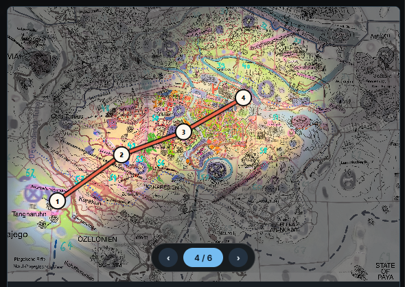

# PlotMapper

PlotMapper is a lightweight browser tool for planning story routes, locations, characters, events, items, notes, and reading flow directly on a map. It runs as a standalone HTML app and can be used locally or via GitHub Pages.

Deutsch weiter unten.

Live version: https://maxliebscher.github.io/PlotMapperTool/

## English

### What is PlotMapper?

PlotMapper helps writers, gamemasters, worldbuilders, teachers, and map-heavy planners turn a map image into a structured story path. Add route points, helper points, context points, notes, locations, labels, and durations, then review the path in a Reader view.

### Features

- Load any map or image as the planning background.
- Add route, place, character, event, and item points.
- Draw route lines with adjustable color and width.
- Use helper points to shape paths or branch without changing route numbering.
- Edit labels, locations, notes, duration, helper state, type, and deletion from the point menu.
- Toggle filters, labels, locations, notes, duration, edit buttons, chapter numbering, and focus mode.
- Present a route step by step with Presentation Mode, keyboard navigation, and configurable Focus Fog.
- Undo/redo point and editing changes.
- Switch themes and language between English and German.
- Save/load projects as versioned `.plotmap.json` files.
- Export the current view as PNG.
- Use the Reader modal for a linear route view, route/context editing, jump-to-map, HTML export, and PDF print flow.

### Project Format

The canonical app format is `.plotmap.json`. It stores the map image, settings, and all points in a round-trip-safe structure:

```json
{
  "schemaVersion": 1,
  "appVersion": "1.1.8",
  "map": {},
  "settings": {},
  "points": []
}
```

Legacy Markdown/old JSON import is intentionally not part of the main app anymore. Old projects can be converted later with a separate converter.

### How to Use

1. Open `index.html` or the live GitHub Pages version.
2. Load a map image.
3. Double-click the map to add points.
4. Edit points via the point menu `(=)`.
5. Save your work as `.plotmap.json`.
6. Export PNG or Reader HTML/PDF when needed.

### Screenshots



Presentation Mode can reveal a route step by step while Focus Fog keeps the unexplored map readable but visually pushed back.

### Development

```powershell
npm.cmd run build
npm.cmd test
npm.cmd run smoke
```

The app source lives in `src/`; `scripts/build.mjs` generates the standalone `index.html`.

### License

Indie devs and small studios may use and adapt this freely. Commercial use by larger companies (10+ employees) requires permission. See [LICENSE.md](LICENSE.md).

## Deutsch

### Was ist PlotMapper?

PlotMapper hilft Autorinnen und Autoren, Spielleitungen, Worldbuildern, Lehrenden und allen mit kartenbasierten Projekten, einen Handlungsweg direkt auf einer Karte zu strukturieren. Du setzt Routenpunkte, Hilfspunkte, Kontextpunkte, Notizen, Handlungsorte, Labels und Dauerangaben und kannst die Route im Reader linear prüfen.

### Funktionen

- Beliebige Karte oder Bilddatei als Hintergrund laden.
- Routen-, Orts-, Charakter-, Ereignis- und Item-Punkte setzen.
- Routenlinien mit einstellbarer Farbe und Stärke zeichnen.
- Hilfspunkte nutzen, um Linien zu formen oder Abzweigungen ohne Nummerierung zu bauen.
- Labels, Handlungsorte, Notizen, Dauer, Hilfspunkt-Status, Typ und Löschen über das Punktmenü bearbeiten.
- Filter, Labels, Handlungsorte, Notizen, Dauer, Edit-Buttons, Kapitel-Nummerierung und Fokus-Modus umschalten.
- Routen Schritt für Schritt im Präsentationsmodus zeigen, inklusive Tastatursteuerung und konfigurierbarem Focus Fog.
- Undo/Redo für Punkt- und Bearbeitungsschritte.
- Themes und Sprache live zwischen Deutsch und Englisch wechseln.
- Projekte als versionierte `.plotmap.json` Dateien speichern/laden.
- Aktuelle Ansicht als PNG exportieren.
- Reader-Modal für lineare Routenansicht, Bearbeitung, Sprung zur Karte, HTML-Export und PDF-Druck nutzen.

### Projektformat

Das kanonische App-Format ist `.plotmap.json`. Es speichert Kartenbild, Einstellungen und alle Punkte round-trip-sicher:

```json
{
  "schemaVersion": 1,
  "appVersion": "1.1.8",
  "map": {},
  "settings": {},
  "points": []
}
```

Legacy-Markdown/alte JSON-Importe sind absichtlich nicht mehr Teil der Haupt-App. Alte Projekte können später mit einem separaten Converter übertragen werden.

### Nutzung

1. `index.html` oder die GitHub-Pages-Version öffnen.
2. Karte laden.
3. Mit Doppelklick Punkte setzen.
4. Punkte über das Punktmenü `(=)` bearbeiten.
5. Arbeit als `.plotmap.json` speichern.
6. Bei Bedarf PNG oder Reader HTML/PDF exportieren.

### Screenshots


Der Präsentationsmodus kann eine Route Schritt für Schritt freilegen, während Focus Fog die unerforschte Karte abdunkelt und die aktuelle Route klar hervorhebt.

### Entwicklung

```powershell
npm.cmd run build
npm.cmd test
npm.cmd run smoke
```

Der Quellcode liegt in `src/`; `scripts/build.mjs` erzeugt die Standalone-Datei `index.html`.

### Lizenz

Indie-Entwickler, Studierende und kleine Studios dürfen PlotMapper frei verwenden und anpassen. Kommerzielle Nutzung durch Unternehmen mit mehr als 10 Mitarbeitern nur mit Genehmigung. Siehe [LICENSE.md](LICENSE.md).

---

Maximilian Georg Liebscher - https://maxliebscher.com
